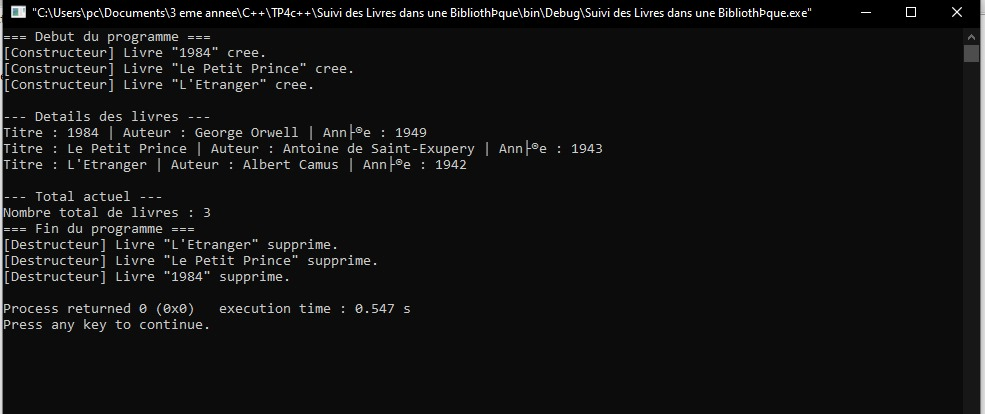
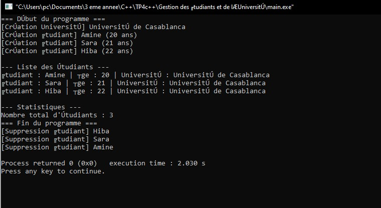

# TP4 – Constructeurs, Destructeurs et Attributs Statiques en C++

##  Cours : Programmation Orientée Objet (C++)

---

##  Objectif général
Ce TP a pour but de comprendre :
- Le rôle des **constructeurs** et **destructeurs** dans la création et la destruction des objets.
- L’utilisation des **attributs et méthodes statiques**, partagés entre toutes les instances d’une classe.
- L’association simple entre classes via des pointeurs d’objets.

---

##  Exercice 1 — Suivi des Livres dans une Bibliothèque

### Objectif
Concevoir une classe `Livre` capable de :
- Compter le **nombre total de livres créés** grâce à un attribut statique ;
- Afficher les informations de chaque livre ;
- Fournir une méthode statique pour afficher le compteur global.

---

###  Spécifications techniques
**Classe : `Livre`**

**Attribut 
`titre` 
`auteur`
`annee`
`nbLivres`

**Méthodes :**
- **Constructeur :** initialise les attributs et incrémente `nbLivres`.
- **`void afficher()` :** affiche les informations du livre.
- **`static void afficherTotal()` :** affiche le nombre total de livres créés.

---
## Résultat visuel

  
<em>Figure 1</em>
 

## Exercice 2 — Gestion des Étudiants et de l’Université

### Objectif

-Créer deux classes associées (Etudiant et Universite) afin de :

-Gérer une association simple entre objets ;

-Illustrer l’utilisation d’un attribut statique pour compter les étudiants ;

-Afficher les informations détaillées des étudiants et de leur université.

### Spécifications techniques

-**Classe : Universite

Attribut	:nom	string	

Méthode :

`void afficherNom()` : affiche le nom de l’université.

-**Classe : Etudiant
Attribut
`nom`
`age`
`universite`
`nbEtudiants`
**Méthodes :**

-Constructeur : initialise les attributs et incrémente le compteur.

-void afficher() : affiche les infos de l’étudiant et le nom de son université.

-static void afficherTotal() : affiche le nombre total d’étudiants créés.

## Résultat visuel

  
<em>Figure 2</em>
 

###  Environnement recommandé

Langage : C++17 ou supérieur

IDE : Code::Blocks, Visual Studio Code, Dev-C++, ou CLion

Compilateur : g++ ou clang++
